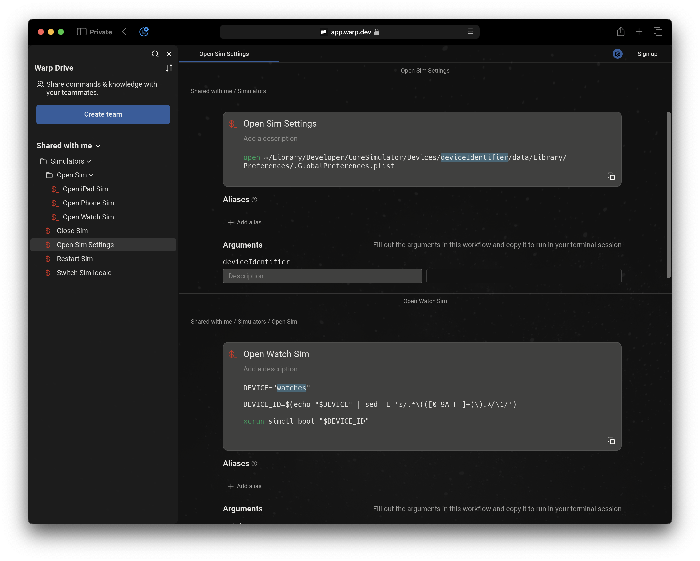

# Tools
Various tools for development that we have created


## Simulator shortcuts
1. [**“Open Sim”**](simulatorShortcuts/Open%20Sim.shortcut) — launches any available simulator (must be created beforehand).
2. [**“Open Sim Settings”**](simulatorShortcuts/Open%20Sim%20Settings.shortcut) - opens the  ```.GlobalPreferences.plist``` file for the selected simulator.
3. [**“Restart Sim”**](simulatorShortcuts/Restart%20Sim.shortcut) - restarts the currently running simulator.
4. [**“Switch Locale”**](simulatorShortcuts/Switch%20Locale.shortcut) - prompts to select a language and updates the locale of the running simulator accordingly.

https://github.com/user-attachments/assets/2c282e66-72fe-4959-ba6f-622e3865fbd5

### Warp commands
There're a set of the same [commands](https://app.warp.dev/drive/folder/Simulators-PQEvBCB6J30zrsOIZjymZf) but for Warp usage
